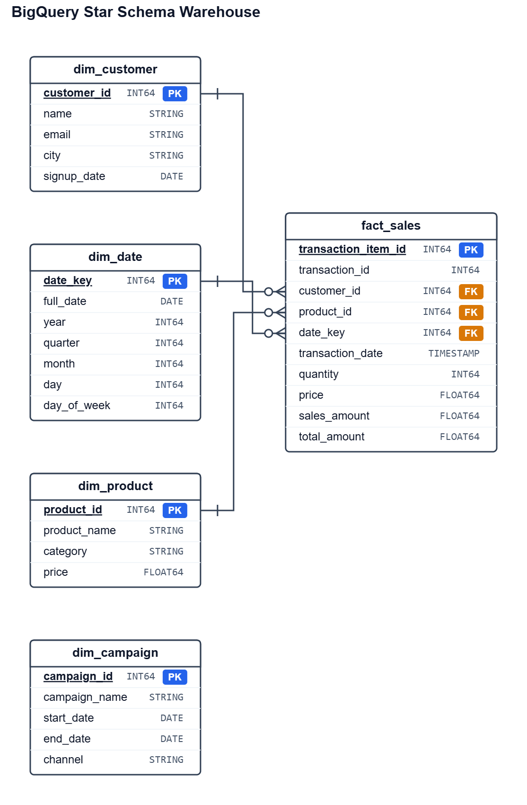

## Data Warehouse Design

A star schema was selected to support analytical workloads and simplify reporting queries.

## ERD

### Fact Table

`fact_sales` stores transaction-level sales metrics and represents the central business process of the model.

Grain:

* One row per transaction item.

Measures:

* quantity
* price
* sales_amount
* total_amount

### Dimension Tables

#### dim_customer

Contains customer attributes used for segmentation and customer analysis.

#### dim_product

Contains product attributes used for category and product performance reporting.

#### dim_date

Provides a standard calendar dimension to support time-based aggregations.

#### dim_campaign

Contains marketing campaign metadata. The source data does not include a relationship between campaigns and transactions; therefore, this dimension is modeled independently and is not currently joined to the sales fact table.

### Partitioning and Clustering

The largest table, `fact_sales`, is partitioned by transaction date and clustered by customer_id and product_id to optimize analytical queries and reduce scan costs.

`stg_transactions` is partitioned by transaction_date and clustered by customer_id to improve transformation performance.

Dimension tables remain unpartitioned because of their relatively small size, with clustering applied where beneficial for join performance.

### Loading Strategy

CSV files are ingested into staging tables using full refresh (`WRITE_TRUNCATE`). Transformation jobs create and maintain dimensional tables and fact tables using SQL executed through Apache Airflow.

This approach provides a reproducible local development workflow while remaining compatible with production BigQuery deployment patterns.
